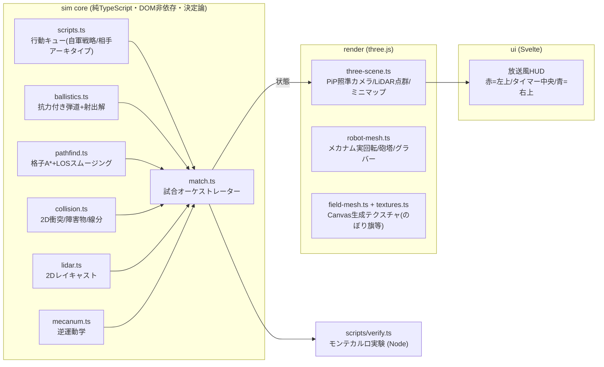

# 試合シミュレーター (viewer/) — 設計・検証ループ・強化学習の見通し

**更新**: 2026-07-04 / 対象コード: `viewer/` (Vite + Svelte 5 + TypeScript strict + three.js)

---

## 1. これは何か

strategy.md で決めた機構・センサー・戦術を**そのまま仮想フィールドに実装**し、
3分間の試合を丸ごと再生・集計するシミュレーター。目的は2つ:

1. **可視化** — 試合の流れ・タイムライン・プレーコールをチーム全員が同じ絵で共有する
2. **検証** — 戦略書の主張を数値で検証し、strategy.md を改訂する
   （`npm run verify` = モンテカルロ実験。結果は strategy.md §11 に反映済み）

## 2. アーキテクチャ



**設計上の要点**

- **sim core は DOM/three に依存しない**。ブラウザとNode (verify) で同一コードが走る。
  乱数は全て seed 付き (mulberry32) → 同じ seed なら同じ試合が再生される（リプレイ・回帰テスト・RLに必須）
- 座標・寸法は `config/field.ts` に一元化（フィールド図の実測が出たらここだけ直す）
- 機構パラメータ (`config/params.ts`) は strategy.md の設計値と1:1対応
  （M3508由来のサイクル・回転数・命中率仮定・雑巾の抗力係数など）

## 3. strategy.md との対応 (何が「実装」されているか)

| strategy.md | シミュレーターでの実装 |
|---|---|
| §4.0 メカナム4輪 (M3508) | 逆運動学で4輪の回転を計算し、ホイール・樽ローラーが実際に回る |
| §4.1 対向ローラー射出 | スピンアップ→整定待ち→送給→射出のシーケンス。ローラー回転数がアニメーション |
| §4.3 スタックグラバー+シンギュレータ | 補充スポットでのフォーク+押さえの一連動作、残弾管理 |
| §4.5.1 UST-20LX+計測輪+ICP | **本物の推定パイプライン**: 270°/20m/40Hz/距離比例ノイズ/移動スキャン歪みのLiDARシム → 計測輪オドメトリ(ノイズ入り)で予測 → 点-線分ICPで補正。推定ポーズは3Dの青矢印、誤差は計測HUDに実測表示 |
| §4.5.5 上段LiDARクラスタ | 2台目LiDAR(0.5m)の外れ点クラスタで相手を推定し赤ゴースト表示（下段では教壇遮蔽で不可能なことをシムが実証） |
| 操縦 | WASD/QE手動走行・FPS照準モード(マウス+クリック射出=物理判定でリアル得点)・スマホ想定の指令パッド |
| §4.5.2 経路生成 | 自陣格子A*+見通し線スムージング (障害物=自陣造作物+教壇、衝突判定つき) |
| §4.5.3 経路追従 | 軸独立台形速度+押し出し衝突解決 (バケツ・机・椅子を轢かない) |
| §4.5.4 弾道テーブル | 抗力モデル (質点+二次抗力) から射出解を都度ソルブ (実機では実測テーブルに置換) |
| §4.5.5 レイヤー2 | 照準カメラPiPに相手車体BBox+バケツ推定位置をオーバーレイ |
| §2.3 タイムライン | 行動キュー (script) が丸ごと再現。相手は3アーキタイプ (手動装填/自動装填/旗ブロック) |
| §2.1 プレーコール | 「smart」ターゲット選択 = バケットコールの発動条件をコード化 |

## 4. 検証ループの運用ルール

```mermaid
flowchart LR
    A[strategy.md の主張] --> B[params/scripts に反映]
    B --> C[npm run verify<br/>(300〜600試合×条件)]
    C --> D{主張と一致?}
    D -- No --> E[strategy.md を数値で改訂<br/>(§11に記録)]
    D -- Yes --> F[主張に「シム検証済み」マーク]
    E --> A
    G[実機の実測値<br/>(8月〜の実射データ)] -->|命中率・弾道を実測に置換| B
```

- 戦略・機構パラメータを変えるPRでは `npm run check` (型) と `npm run verify` を回す
- **シムの命中率は仮定値**。8月の実射データ取得後に `params.ts` を実測で置き換えて再検証する
  （それまでの結論は「仮定に対する最適」であることを忘れない）

## 5. 強化学習 (RL) 入門 — このシミュレーターで何ができるのか

> 強化学習未経験者向けに、比喩→成果物→時間→よくある疑問の順で説明する。

### 5.1 強化学習を一言でいうと

**「試合を何万回も自動で戦わせて、勝ち方を自分で発見するプログラムを育てる」** こと。

- 普通のプログラム: 人間が「相手が装填中ならバケツを狙え」とルールを**書く**
- 強化学習: ルールは書かない。「得点=ごほうび（報酬）」だけ与えて何万試合も打たせると、
  「この状況ではこう動くと得点が伸びる」を**勝手に見つける**

私たちのシミュレーターは「1試合を高速に再生して得点を返す装置」なので、
強化学習にとっての**練習場（環境）**がすでに完成していることになる。

### 5.2 成果物は何か？「パラメーターの値」なのか？

半分正解。成果物は **方策（ポリシー）と呼ばれる小さなニューラルネットワークのファイル**（数百KB〜数MB）。

```
入力: 今の状況を数値にしたもの (約20個の数字)          出力: 次にとる行動 (10択くらい)
┌──────────────────────────┐      ┌──────────────────────┐
│ 残り時間 / 自分と相手の位置 / 残弾数     │ →NN→ │ ①旗を撃つ ②バケツを撃つ      │
│ 相手の電源状態 / 両者のスコア / 旗の枚数 │      │ ③補充に戻る ④位置Lへ ⑤デナイアル…│
└──────────────────────────┘      └──────────────────────┘
```

- 中身は「重み」と呼ばれる数十万個の数値の塊。**人間が読んでも意味は分からない**
  （PIDゲインとか射出速度のような「機構パラメータの最適値」が出てくるわけではない、ここが誤解しやすい）
- だから私たちの使い方は2段階:
  1. 学習済みNNとシミュレーターで対戦・再生し、「へえ、残り40秒で補充を捨てて撃ち切るのか」等の**行動パターンを観察**する
  2. 見つけた良い行動を**人間が読めるプレーコール表（strategy.md §6.3）に翻訳して採用**する
- つまり最終成果物は「NNファイル」ではなく **「改訂されたプレーコール表」**。
  ロボット本体にNNを載せる必要は無い（載せない方が検査・説明・安全ですべて有利）

なお「命中率を何%にすると勝てるか」みたいな**数値の感度分析は強化学習を使わなくても出せる**。
それは今すでに `npm run verify`（モンテカルロ=条件を変えて大量に試合を回す総当たり）でやっていて、
strategy.md §11 の表がその成果物。**強化学習が価値を持つのは「状況に応じた判断の順番・タイミング」
という、総当たりでは組み合わせが爆発する領域**だけ。

### 5.3 どれくらい時間がかかるのか（目安）

| 項目 | 目安 | 根拠 |
|---|---|---|
| 1試合のシミュレーション (ヘッドレス) | 20〜30ms | verify 実測: 約6,000試合を1〜2分で処理 (1コア) |
| 学習1回に必要な試合数 | 5万〜20万試合 | 行動が10択・1試合60判断程度の小さい問題なので、PPOという定番手法の常識的な量 |
| **合計 (8コアPCで並列)** | **30分〜数時間** | 20万試合 × 25ms ÷ 8コア ≈ 10分 + NN計算のオーバーヘッド。GPUは不要 (ネットワークが小さいので) |
| 環境をRL用に整える作業 | 2〜4日 | 下記5.5 |

つまり「一晩回す」レベルであって「研究室のクラスタが要る」レベルではない。

### 5.4 Unity じゃなくて Web (TypeScript) 製でもいけるのか？

**いける。むしろ有利。** よくある誤解の整理:

- Unity (ML-Agents) が提供しているのは「物理エンジン+3D表示つきの環境」。
  強化学習に必要なのは表示ではなく **「速い step() 関数と報酬」だけ**
- このシミュレーターは最初から **sim core（純TypeScript・描画非依存）と描画を分離**してある。
  学習時は three.js を一切通らないので、画面付きUnityより速いくらい
- 3D表示は「学習した方策の観察・デバッグ」で使う。学習と観賞を分けられるのが今の設計の利点

学習ライブラリ (stable-baselines3 等) は Python 製なので、つなぎ方は2択:

| 方式 | 工数 | 備考 |
|---|---|---|
| A. Node をサーバにして Python から叩く (WebSocket/stdio) | 2日 | コード共有できるが通信オーバーヘッドあり |
| B. sim core (~1,500行) を Python に移植 | 1週間 | 本気で学習を回すならこちら。numpy化で更に高速 |

### 5.5 並列でできるのか？

**できる。強化学習の定番構成そのもの。**

- 環境（試合）同士は完全に独立 → **試合単位で恥ずかしいほど並列化できる** (embarrassingly parallel)
- 定番ツールがそのまま使える: Gymnasium の VectorEnv / SB3 の `SubprocVecEnv` で
  「8プロセス×各1試合」を同時に回し、8倍速で経験を集める
- このシムは**全乱数がシード化済み**なので、並列でも再現可能 (バグ調査で決定的に効く)
- JS側で並列するなら Node の `worker_threads` で同じことができる

### 5.6 やるなら、の手順 (未経験者向けロードマップ)

1. **まず強化学習なしで絞り切る**: `verify.ts` の総当たりで答えが出る問いを先に潰す (今ここ)
2. **8月: 実測値をシムに入れる**: 実射で測った命中率・サイクルタイムで `params.ts` を置換。
   仮定のままのシムで学習しても「仮定に最適な戦術」しか出ないため、ここが前提条件
3. **env API を切る (1〜2日)**: `MatchSim` に「状況を数字で返す関数」「行動を受け取る関数」「報酬=得点差」を追加
4. **チュートリアル通りに PPO (1日)**: stable-baselines3 の `PPO("MlpPolicy", env)` はほぼ3行で動く
5. **self-play (数日)**: 相手を「過去の自分のコピー+3アーキタイプ」にして交互に強化
6. **観察と蒸留**: 学習済みAI同士の試合をこのビューワーで再生 → 発見をプレーコール表へ

### 5.7 注意 (期待値の管理)

- **実機にNNは載せない**。戦術判断は人間 (strategy.md §4.5 の設計原則)。RLはオフラインの戦術発見ツール
- シムの命中率が仮定のうちは学習結果も仮定の産物。**実測反映後 (8月末以降) が本番**
- 「総当たり (verify) で足りる問いに RL を使わない」— 先に安い道具で答えが出るなら、それでよい

## 6. 既知の簡略化 (TODO)

- **雑巾の空力は簡易モデル** (質点 + 二次抗力 + 一定揚力 + 個体差±8〜12%)。実物は飛行中に
  回転・変形して抗力が時々刻々変わるため、このモデルの絶対精度は信用しない。
  シムの役割は「相対比較と桁の把握」で、**絶対値は8月の実射テーブルで置換する**のが前提
  (ユーザー指摘のとおり、ここがシム最大の不確かさ)
- 旗への「掛かる/掛からない」は確率モデル (FPS/手動射出のみ幾何judgement)
- 旗の重ね掛け飽和は線形近似 (掛かるほど −2%/枚、下限45%)
- 審判・リトライ・反則 (教壇乗り上げ等) は未実装 (衝突でスタックはする)
- 相手アーキタイプは3種のスクリプト。実チームの映像が出たら (9/20〜の先行地区) 追加する
- フィールド座標は図面からの概算。実測後 `config/field.ts` を更新
