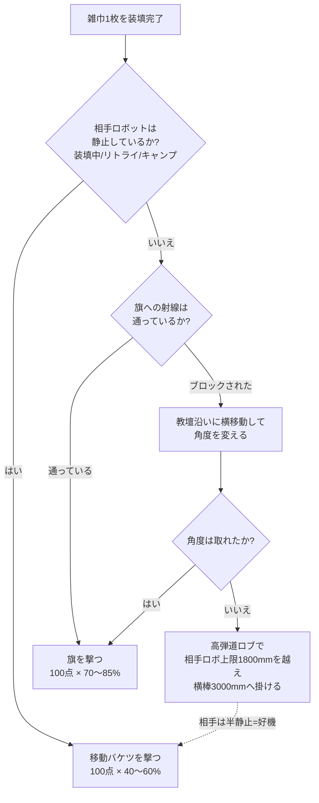
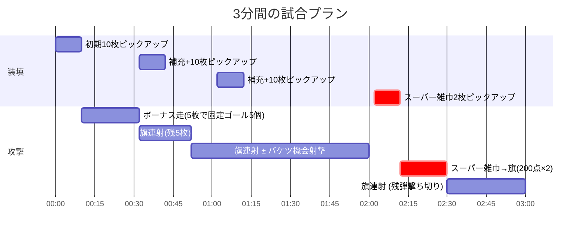
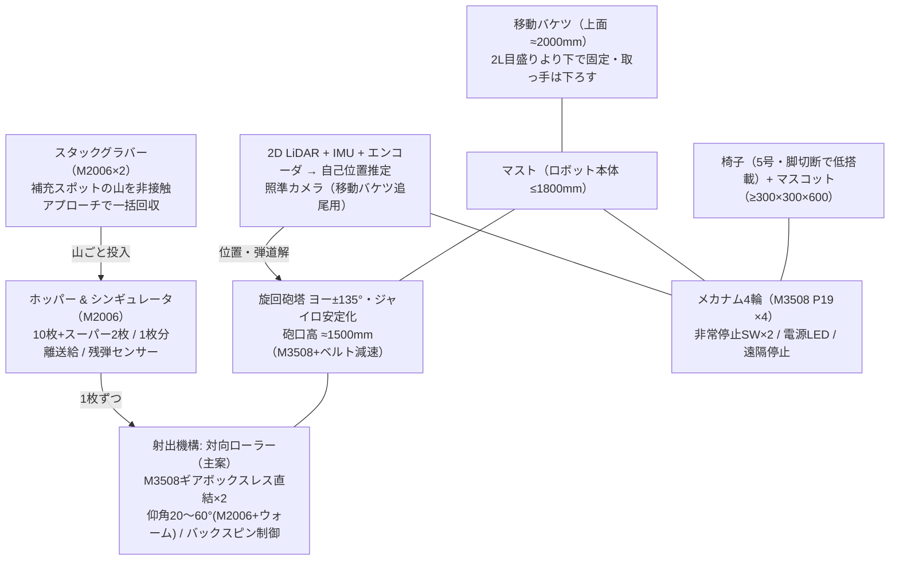
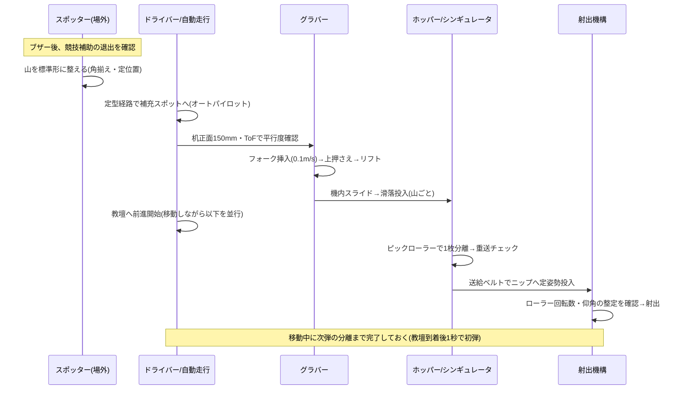
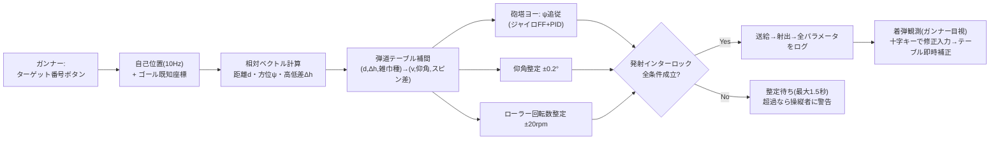
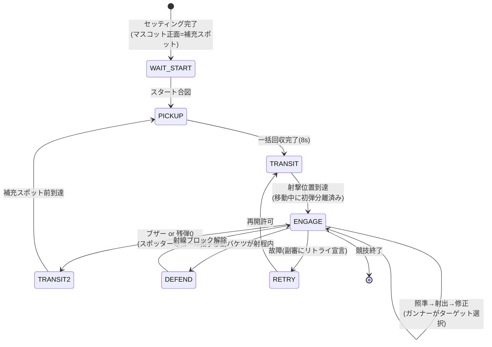
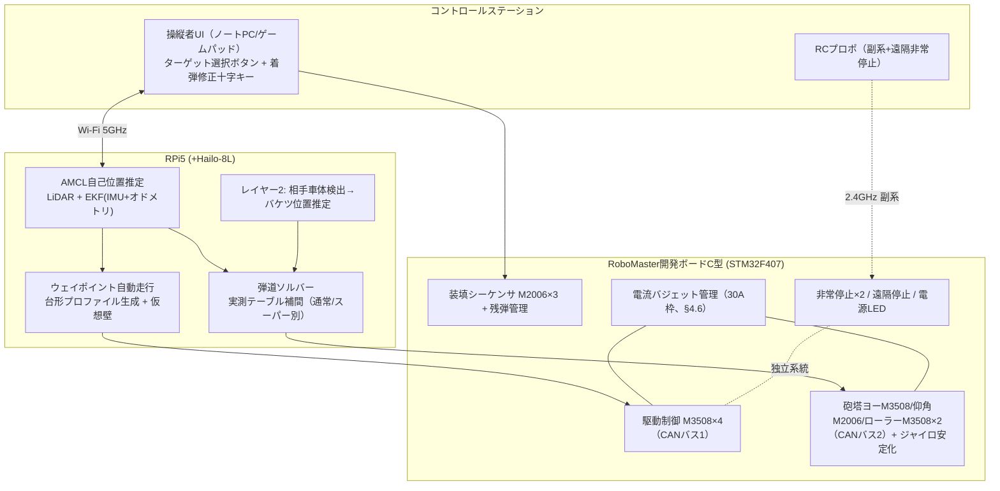
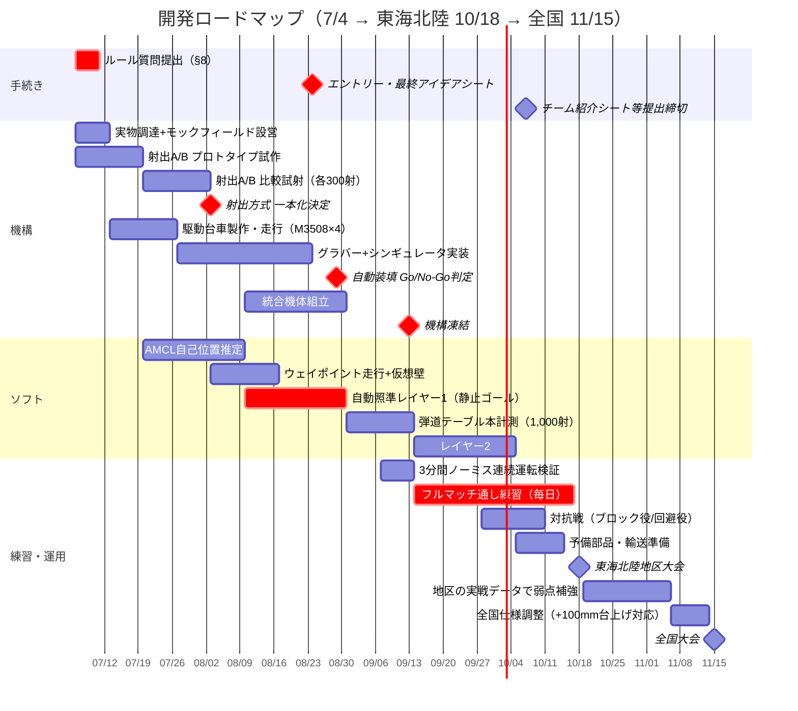

# 高専ロボコン2026「高専杯 雑巾投擲選手権」全国優勝戦略書

**版**: 2.4（2026-07-04 / 第2回検証: ICP自己位置を実装・実証、**2段LiDAR構成へ変更**（教壇遮蔽の発見）、
UST-20LX採用、計測輪追加、機能→機構リスト・位置合わせ局面リスト新設。§11.3参照）
**根拠資料**: ルールブック0415版・フィールド図0415版・第1回FAQ（5/29版）・シミュレーション検証（`viewer/`, §11）

> **地区大会は東海北陸 10/18（日）**（8地区中最遅）。全国は11/15（日）。準備期間は今日から約15週間。
> アイデアシートは提出済み（内容は本書に反映していない。齟齬がないかはチーム側で照合すること。
> 8/24のエントリー・最終アイデアシート以降はアイデア変更が原則不可な点にだけ注意）。
> 試合の流れは `viewer/index.html`（three.js製3Dシミュレーションビューワー）で可視化できる。

---

## 0. 結論（エグゼクティブサマリー）

1. **この競技は「連射力」の競技ではない。「命中率」の競技である。**
   雑巾の供給は3分間で最大32枚と固定されている。平均5.6秒に1枚しか投げるものがない。
   ただし補充往復・移動のオーバーヘッドがあるため、**機構としての射出サイクルは3.0秒以下を目標**とする
   （シム検証§11-E1: 3.0秒までは得点プラトー、4.2秒で−300点、1.8秒への短縮は+20点で投資価値なし）。
   それ以上の連射性能に資源を使わず、**再現性（命中率）に全振りする**（命中率+10% ≈ +170〜190点、§11-E2）。

2. **主戦場は「旗」である。移動バケツではない。**
   旗は静止目標・1枚100点・枚数無制限・雑巾の重ね掛けも得点（FAQ 4.2 Q3）。
   移動バケツは同じ100点だが、逃げ回る目標を透明ポリカバケツ越しに追う必要があり、期待値で旗に劣る。
   移動バケツは「相手が止まった瞬間（装填中・旗前キャンプ中）だけ撃つ」機会目標とする。

3. **自動装填が最大の構造的優位。**
   人が装填する場合はスタートゾーン+駆動電源OFF+審判許可が必須（4.1.4b、FAQ 4.1 Q11で再確認）。
   ロボットが自動で取る場合はこの制約が一切ない。1試合3〜4回の補充で合計60〜90秒の差がつく。
   さらに「電源OFFで静止する時間」がないため、相手から見て**移動バケツを狙いにくいロボット**になる。

4. **勝敗を分けるのは9〜10月の練習量。**
   機構は9月中旬に凍結し、以降は毎日フルマッチ通し練習。操縦者3名の役割分担と
   プレーコール（状況別の定型戦術）を体に入れる。ロボットの完成度が同じなら、試合運びで勝つ。

**目標スコア: 地区大会で安定800点、全国決勝レベルで1,200〜1,600点。**

---

## 1. ルール分析 — 得点構造と「効く」事実

### 1.1 得点表

| ゴール | 通常雑巾 | スーパー雑巾 | 目標の性質 |
|---|---|---|---|
| 移動バケツ（相手ロボ頭上） | 100点 | 200点 | **動く**。φ273mm開口、上面高さ1200〜2100mm |
| 旗（横棒に掛かる） | 100点 | 200点 | **静止**。横棒高さ3000mm・幅600mm。重ね掛けも得点 |
| 机①② | 20点 | 40点 | 静止。机下棚の内側空間（W650×D450×H760の机） |
| 固定バケツ②③ | 5点 | 10点 | 静止。台上H600/H300 |
| 固定バケツ① | 1点 | 2点 | 静止。床直置き |
| 全固定ゴール制覇ボーナス | +100点（1試合1回） | | 同点時の第1判定基準でもある（4.4.2a） |

### 1.2 見落とされがちな決定的ルール（FAQ第1回で確定）

| # | 事実 | 出典 | 戦略への影響 |
|---|---|---|---|
| 1 | **得点判定はすべて競技終了時**。 | 4.2、FAQ 4.2 Q2 | 逆転は最後まで起こりうる。**ただし雑巾の装填は補充机からのみ／敵の雑巾を回収機構で回収するのは不可**（後述）→ 相手雑巾の抜去による「デナイアル」は行わず、防御は迎撃・射線ブロックで行う |
| 2 | 相手の投擲雑巾への**空中迎撃も、射線上に立つブロックも合法** | FAQ 4.6 Q3 | 防御は「機構」でなく「位置取り」でやる。逆に相手のブロックは高弾道で越える |
| 3 | 移動バケツをロボット足回りと**独立して動かすのは禁止** | FAQ 3.2 Q2 | バケツ高さ可変・水平維持ジンバル等は不可。回避は車体移動のみ |
| 4 | 急加減速で自バケツ内の相手雑巾が**落ちても特段の措置なし** | FAQ 3.2 Q1 | 被弾しても激しい機動で振り落とせる可能性（終了時判定なので落ちれば無得点） |
| 5 | カートリッジ交換式の装填は**不可**。治具の放置も不可 | FAQ 4.1 Q9 | マガジン一括交換戦術は死亡。雑巾そのものをロボットが取るしかない |
| 6 | 補充スポットの雑巾を**メンバーが（場外から）並べ直し・折り畳みしてよい** | FAQ 4.1 Q2, Q3 | ピックアップの成功率を人間が場外から支援できる。専任係を置く |
| 7 | 相手の**装填中に移動バケツを狙ってよい** | FAQ 4.6 Q4 | 手動装填チームは電源OFFで静止する＝**最高の射撃チャンス** |
| 8 | マジックテープでの雑巾保持・絡め取りは**全面禁止** | FAQ 3.1 Q5 | 保持は機械式クランプ/摩擦のみ |
| 9 | 針の使用禁止 | FAQ 4.6 Q6 | 同上 |
| 10 | 自陣の旗に掛かった雑巾を撃ち落とすのは違反、しかも**落ちても得点扱い** | FAQ 4.2 Q5 | 旗に掛けられたら取り返す手段はゼロ。**旗の防御は「掛けさせない」しかない** |
| 11 | 保持中の雑巾も含め、ロボットのいかなる部分もバケツ2L目盛りより上に出られない | 3.2.3c、FAQ 3.2 Q3 | バケツ搭載高さと射出機構高さの設計制約（§4.7参照） |
| 12 | 複数射出機構の同時発射は不可。1枚が機構を離れてから次 | FAQ 4.1 Q14, Q15 | 多連装同時撃ちは不可。ただし高速な逐次射出は可 |
| 13 | 補充・時間経過はブザーで通知 | FAQ 4.1 Q13 | 0:30/1:00/2:00/2:30の行動切替をブザー基準で自動化・定型化できる |
| 14 | 相手の補充スポットの雑巾に当てて落とすと**自チームの違反** | FAQ 4.6 Q7 | 相手スタートゾーン方向への流れ弾に注意。射界管理が必要 |

### 1.3 供給タイムラインと「レート上限」

| 時刻 | イベント | 累計供給 |
|---|---|---|
| 0:00 | 補充スポットに10枚（開始まで接触不可） | 10 |
| 0:30 | +10枚（ブザー） | 20 |
| 1:00 | +10枚（ブザー） | 30 |
| 2:00 | +スーパー雑巾2枚（ブザー） | 32 |
| 2:30 | 終盤局面（残弾を撃ち切る＋射線ブロック防御） | 32 |

**32枚 ÷ 180秒 = 5.6秒/枚。** ただし補充往復（3〜4回×十数秒）と陣地間の移動が時間を食うため、
シム検証では**機構サイクル3.0秒以下で初めて32枚を使い切れる**（§11-E1。4.2秒だと4枚残して−300点）。
つまり「1.5秒に1枚撃てる砲」は不要だが「5秒に1枚」では遅い。**目標: サイクル3.0秒 + 1枚も無駄にしない照準。**

### 1.4 フィールドの距離感（フィールド図0415を300dpi精査、寸法連鎖が5400/5400/10500で完全に閉じることを確認済み）

- フィールド内寸: **10.5m（教壇平行）× 11.4m（教壇直交）**。各陣5.4m + 中央に教壇（W600×H200、
  南北フェンス内縁まで通し。上面は共有ゾーン、接触可・乗り上げ不可）。フェンスはL字断面 H150×D150
- 主要ゴールの教壇端からの距離（中心まで）: **固定バケツ① 0.57m / 旗 2.73m / 椅子(障害物) 4.68m**
  （x=-0.55の行。寸法連鎖は「シート端-端」定義: 490+460+1500+450+1760+340+400=5400）
- 固定バケツ②（H600台上, x=+1.27）/ ③（H300台上, x=-2.37）は教壇端から1.0m（z=±1.48）
- 机①(x=+2.295)②(x=-3.395)は z=±3.855。**全ての机は W650が教壇平行(x)方向**、棚開口は教壇側
- 補充スポット机はスタートゾーンに**隙間ゼロで隣接**（開口はスタートゾーン側）。
  コントロールステーションは「フェンス外の操縦席」ではなく**フィールド内コーナーの障害物**（北・東フェンス内縁に接触）
- 旗: 土台390角、ポール〜横棒3000mm、旗本体W600×H1800。横棒は回転しないよう固定（FAQ 2.1 Q1）。
  **旗だけ左右鏡映でなく「z反転+ヨー180°」: 布・横棒は赤=スタートゾーン側(+x)/青=反対側(-x)に突き出す**
  → 照準点はポール中心でなく「横棒の中点（ポールから±0.31m）」に取る
- 全国大会はフィールド全体が約100mm台上げされる（2.1.9e）→ 弾道テーブルは相対高さで持つこと

**結論: 教壇に張り付けば、移動バケツ以外の全ゴールが射程1.2〜4.5mの近距離静止目標になる**
（旗は旧読取りより約0.4m遠いが実効射程内）。この距離なら弾道はほぼ再現可能で、
勝負は機構の再現性と自己位置の正確さで決まる。

---

## 2. 基本戦略 — 「旗を刈り、止まった奴を撃つ」

### 2.1 目標の優先順位（期待値ベース）

雑巾1枚の期待値 = 得点 × 命中率。設計目標命中率での比較:

| 目標 | 得点 | 目標命中率（練習で到達させる値） | 期待値/枚 |
|---|---|---|---|
| 旗（教壇前2〜3mから） | 100 | 70〜85%（静止目標・反復練習で上げられる） | 70〜85 |
| 移動バケツ（相手静止時） | 100 | 40〜60% | 40〜60 |
| 移動バケツ（相手機動中） | 100 | 10〜25% | 10〜25 |
| 机①②（近距離） | 20 | 90%+ | 18+ |
| 固定バケツ②③ | 5 | 90%+ | 4.5 |
| 固定バケツ① | 1 | 95%+ | 1 |

→ **デフォルトの弾は全部旗。** 移動バケツは「相手が止まった時だけ」撃つ——ただしシム検証で
この条件はさらに厳しくなった（§11-E3/E5）: **相手が静止していても、旗の実効命中率（重ね掛けで
徐々に低下する）がバケツ静止命中率を上回っている限り、旗を撃ち続ける方が期待値が高い。**
バケット・コールの発動条件を数式で持つ:
`p(バケツ|静止) × 100 > p(旗) × 飽和係数 × 100` が成立した時だけ切替（普段は成立しない。
成立するのは ①旗が掛かりすぎて飽和した終盤 ②旗をブロックされ、ロブの命中率も低い時 ③実測で旗pが想定より低い時）。

ターゲット選択の判断フロー:

### 2.2 全ゴールボーナスの扱い

251点（151点+ボーナス100点）を6枚で取れるが、同じ6枚を旗に使えば期待値420〜510点。
**純粋な期待値ではボーナス走は劣る。それでもやる。理由:**
- 同点時の第1判定基準が「全固定ゴール制覇」（4.4.2a）
- 当日旗の調子が悪い/ブロックが厳しい場合のフロア（下限保証）になる
- 近距離ゴールは命中率90%超なので251点は「ほぼ確定利益」

ただし**最初の10枚では机①②と固定バケツ①②③の5個だけ回り（46点分）、旗は通常営業で狙う**。
旗に1枚掛かった時点でボーナス成立。専用の「旗用の1枚」は割り当てない。

シム検証（§11-E3）ではボーナス走の機会費用は約−100点（旗オンリー戦略が全対戦相手に対し+80〜110点）。
それでも**同点時第1判定基準+旗不調日の保険**として実施する。ただし大差で勝っている再戦相手や、
旗の調子が完璧な日には「旗オンリー」への切替をコール可能にしておく（§6.3）。

### 2.3 タイムライン計画

**Phase 0（セッティング）**: FAQ 4.1 Q10が要求するのは「**マスコットの正面**が補充スポットに正対」だけで、
**車体の向きは自由**。図面精査で補充机は**スタートゾーンに隙間ゼロで隣接し、棚開口がスタートゾーン側**
と確定（§1.4）。攻撃方位（相手陣向き）のまま前進するだけで開口に正対するため、
車体正面（砲塔基準方位）は相手陣向きで搭載し、**椅子+マスコットだけを補充スポット方向へ小角度振る**。
補充時は前面下部グラバーで山ごと回収する。試合を通して車体旋回ゼロは維持。

**Phase 1: ボーナス走 + 旗開店（0:00〜0:45）持ち弾10枚**
1. スタート → 補充机はスタートゾーンに隣接 (§1.4)、**その場で正対して山ごと一括ピックアップ**（移動〜1秒+回収〜8秒）
2. 教壇へ前進しつつ照準。片翼から順に 机→バケツ③→②→①→反対翼の机 と掃くルートで5枚
3. 残り5枚を旗へ。期待: 46 + 旗3〜4枚(300〜400) + ボーナス100 ≒ **450〜550点**

**Phase 2: 旗刈りフェーズ（0:45〜2:00）持ち弾+20枚**
4. 0:30、1:00のブザーで補充スポットへ戻り自動ピックアップ（各10秒、電源OFF不要）
5. 基本は旗連射。**相手の装填静止・リトライ復帰待ち・ブロック姿勢を検知したら移動バケツに切替**
6. 期待: 旗10〜13枚(1,000〜1,300) or 旗+バケツ混合

**Phase 3: スーパー雑巾と回収判断（2:00〜3:00）**
7. 2:00ブザーでスーパー雑巾2枚を最優先ピックアップ。**スーパーは旗に使う**（静止目標に200点×2。
   移動バケツへの博打に使わない。ただし相手が装填静止中なら例外的にバケツ可）
8. 2:30以降の分岐（操縦チームのコール判断、§6.3のプレーコール表参照）:
   - **前提ルール**: 雑巾の装填は補充机からのみ。**敵チームの雑巾を回収機構で回収することはできない**。
     したがって「相手雑巾の抜去（デナイアル）」戦術は採らない
   - **接戦** → 残弾を旗と自陣移動バケツ抑止（相手の移動バケツへの射線ブロック）に振り、失点を防ぐ
   - **大差リード** → 教壇に張り付いて旗連射を続けるだけ。リスクを取らない

**スコアモデル（命中率を保守的に見た場合）**

| シナリオ | 旗掛け率 | 概算スコア |
|---|---|---|
| 保守（地区大会合格ライン） | 50% | 46+100+旗11枚+スーパー1枚 ≒ **1,050** |
| 標準 | 65% | ≒ **1,350** |
| 理想（全国決勝） | 80% + バケツ2〜3枚 | **1,700〜2,000** |

### 2.4 防御ドクトリン

自陣の失点源は ①移動バケツ（100点/枚） ②旗（100点/枚、掛けられたら除去不能） ③固定ゴール群。

1. **移動バケツは「高く・動く的」にする**: 搭載高さは実用上限（§4.7、上面約2000mm）。
   相手は近距離から高い放物線を強いられる。こちらは自動装填なので静止時間が構造的に短い。
2. **攻撃位置=防御位置**: 教壇沿いの横移動（ストレイフ）を撃ち続けながら行う。
   旋回砲塔が車体移動を補償するので「動きながら撃つ」が成立する（§4.5）。これが最大の回避行動。
   **v2.4追記 — 「静止中もバケツを動かせないか」への回答**: バケツを機構で独立に動かすのは
   **明確に違反**（FAQ 3.2 Q2「足回りの動きとは関係なく、独立して移動バケツを動かすことは
   認められません」）。合法な代替は**車体ごと動き続けること**なので、射撃サイクル中も
   ±10cmの微動（マイクロムーブ）を標準運転とする（シム実装済み。相手の照準モデル上
   「静止」判定を外れるだけで被弾期待値が bucketStill→bucketMove 相当まで下がる）。
3. **被弾したら振り落とす**: 移動バケツに入れられたら、次の補充移動のついでに急加減速（FAQ 3.2 Q1で黙認）。
   期待はしないがタダで試せる。
4. **旗ブロックはしない（原則）**: こちらの3分は攻撃に使う方が期待値が高い。
   例外: 終盤リード時に相手がスーパー雑巾を旗に撃つ構えなら、射線に車体を置く価値がある（200点×2の抑止）。

**「旗ブロックって本当に成立するの？」への回答 (v2.4)**: 横棒は3,000mm、ロボット上限は1,800mm。
**棒そのものは絶対に塞げない**。ブロックが効くのは「低い弾道（発射角40°未満の低伸弾道）が
ブロッカーの車体高を通過する」場合だけで、弾道シム（§11-E0）ではロブ弾道（58°以上）は
旗手前1.2mの位置で高さ2m超を通過するため**物理的に遮蔽不可能**。つまり:
- ロブを撃てる我々に対して旗ブロックはほぼ無力（命中率低下は姿勢制約分のみ、flagLob≒0.6と評価）
- 逆に低伸弾道しか持たないチームには有効 → 我々が「ブロックする側」に回る価値も、
  相手が低速・低角チームだと判明した時だけ生じる（§6.3のコール判断）

---

## 3. コンセプト機体「FLAGSHIP」（フラグを取りに行く旗艦）

寸法・重量: スタート時 900×900×1150mm（バケツ除く）／競技中 ≤1200×1200×1800mm／≤35kg（椅子・バケツ込み）。

設計の三本柱:
1. **静止ゴールは「見ないで当てる」** — LiDAR自己位置推定 + 既知のゴール座標 + 実測弾道テーブル。
   カメラ照準より先にこれを完成させる。照明・背景に依存せず、全国のフィールド差(+100mm)にも座標更新だけで対応。
2. **雑巾ハンドリングは「山ごと取って機内で1枚に分離」** — フィールド側での1枚ピックは難度が高い。
   確実に取れる「山ごと」を選び、分離という難問は制御された機内環境で解く。
3. **撃ちながら動く** — 砲塔が車体運動を打ち消す。攻撃継続と被弾回避を同時に成立させる。

---

## 4. 技術選定 — 比較検討と採用理由

> 本章が本書の核。各サブシステムについて**候補を並べて比較し、なぜそれを採用したか**を残す。
> アイデアシート・テストラン・審査でも「なぜこれか」を即答できる状態を保つこと。
> 比較表の記号: ◎=大きな強み ○=可 △=懸念あり ×=不採用理由になる欠点

### 設計の出発点: 要求機能 → 搭載機構リスト

「載せたい機構」からではなく「試合で必要な機能」から逆算する。以下が本書全体の目次でもある。

| # | 要求機能 (何ができないと勝てないか) | それを実現する機構/センサー | 詳細 |
|---|---|---|---|
| F1 | 全方向移動 (姿勢維持ストレイフ・後退補充) | メカナム4輪 (M3508×4) | §4.4 |
| F2 | 雑巾を7〜15m/sで再現性高く射出 | 対向ローラー (M3508GBレス×2) + 旋回砲塔 + 仰角 | §4.1 |
| F3 | 32枚を人手なしで装填 | 前面下部スタックグラバー + ホッパー + シンギュレータ | §4.3 |
| F4 | 自分の位置を±30mm/±0.5°で知る | **下段LiDAR ×2 (UST-20LX 前後, 0.12m)** + 計測輪3輪(コの字) + ジャイロ + ICP | §4.5.1 |
| F5 | 相手 (移動バケツ) の位置を知る | **上段LiDAR (0.5m)** のクラスタリング (+補助カメラ) | §4.5.5 |
| F6 | 被弾を減らす | 高バケツ (2.0m) + 射撃中も車体微動 (§2.4) | §4.7 |
| F7 | 雑巾・人を巻き込まない (7.2.6) | 全周スカート + ホイールフェンダー + 回転部カバー | §4.4 |
| F8 | 終盤の失点抑止 | 相手移動バケツへの射線ブロック (位置取り防御) | §2.4 |
| F9 | 規定装備 | 非常停止×2 + 電源LED + 遠隔停止 + 椅子 + マスコット(補充スポット向き) + 移動バケツ | §4.8-4.9 |
| F10 | 通信断でも安全 | 2系統無線 + 断検知即停止 | §4.5.7 |

### 4.0 アクチュエータプラットフォーム: RoboMaster M2006 / M3508 で統一

**方針（チーム決定事項）: モーターは原則 DJI RoboMaster M2006 P36 と M3508 P19 の2種で構成する。**

カタログ主要スペック（**購入後に実測でダイナモ確認すること**）:

| 項目 | M3508 P19 + C620 | M2006 P36 + C610 |
|---|---|---|
| 種類 | ブラシレスDC + 遊星減速 | ブラシレスDC + 遊星減速 |
| 減速比 | 約19.2:1（3591/187） | 36:1 |
| 定格電圧 | 24V | 24V |
| 無負荷回転数（出力軸） | 482rpm | 500rpm |
| 定格トルク / 定格電流 | 3.0N·m / 10A | 1.0N·m / 3A |
| ESC | C620（FOC、連続20A） | C610（FOC、最大10A） |
| 制御I/F | CAN 1Mbps（電流指令・エンコーダ/温度フィードバック内蔵） | 同左 |
| 質量 | 約365g | 約90g |

**この2種で統一する理由（他の選択肢との比較）:**

| 候補 | トルク/重量 | 制御性 | 調達・保守 | 総合 |
|---|---|---|---|---|
| **RoboMaster M2006/M3508（採用）** | ◎ 高出力密度 | ◎ CAN電流制御+エンコーダ内蔵。ドライバ設計不要 | ◎ 2種に統一→**予備が全系統で共用できる**。部の在庫・ノウハウ資産をそのまま使える | **採用** |
| マクソン/中空カップモーター | ◎ | ○ 別途ドライバ | × 高価。調達リードタイムも長い | 見送り |
| 汎用DCギアード（IG42等）+自作ドライバ | △ | △ 外付けエンコーダ+ドライバ開発が必要 | ○ 安いが開発工数を食う | 見送り |
| ホビーサーボ（大型） | △ 連続回転・速度制御に不向き | △ | ○ | 補助軸のみ検討 |
| ステッピング | △ 脱調リスク、重い | ○ オープンループ | ○ | 見送り |

決め手は**「電流指令ベースのCAN制御」**。ルール3.2.5の「遮断素子合計30A」制約下では、
全モーターの消費電流をソフトウェアで常時把握・配分できることが安全マージンと性能の両立に直結する
（§4.6 電源管理参照）。エンコーダ・温度センサー内蔵で配線も最小化でき、11軸規模でも工数が破綻しない。

**モーター配分表:**

| 系統 | モーター | 数 | 選定理由 |
|---|---|---|---|
| 駆動輪 | M3508 P19 | 4 | 30kg級を2.5m/s+1.5m/s²で走らせるトルク（後述の試算） |
| 射出ローラー | M3508 **ギアボックスレス** | 2 | 素モーターは無負荷約9,000rpm級 → φ100ローラーで周速40m/s超の余裕。RoboMaster競技の摩擦ホイールで実績多数の定石構成 |
| 砲塔ヨー | M3508 P19 + ベルト3:1 | 1 | 砲塔慣性の高速追従（ジャイロ安定化に帯域が要る）。M2006では慣性負けする |
| 仰角 | M2006 + ウォーム | 1 | 低速高保持。ウォームの自立保持で停電時も角度維持 |
| シンギュレータ（ピックローラー） | M2006 | 1 | 低トルクで足りる。90gの軽さが砲塔搭載に効く |
| グラバー開閉/昇降 | M2006 | 2 | 同上 |
| **合計** | M3508×7、M2006×4 | 11 | 予備はM3508×2、M2006×2、C620/C610各2を携行 |

駆動の妥当性試算: M3508定格3.0N·m × 4輪、φ127メカナム → 推力 ≈ 4×3.0/0.0635 ≈ 189N。
車重35kg（上限）でも加速度5m/s²超の余裕。最高速 482rpm×π×0.127 ≈ **3.2m/s**。
実運用は電流バジェット（§4.6）で加速度1.5〜2m/s²に制限して30A枠に収める。

### 4.1 射出機構

**候補比較（評価軸は「命中率競技」に合わせて再現性を最重視）:**

| 候補 | 再現性 | ルール適合性 | スーパー雑巾(400×600) | サイクル | 開発リスク | 判定 |
|---|---|---|---|---|---|---|
| **A. 対向ローラー（採用・主案）** | ◎ ローラー周速=射出速度がエンコーダで閉ループ管理できる。姿勢もニップで規定される | △ ニップ通過時の一時変形が「折り込み」(4.1.5)と解釈されるリスク → **質問提出中** | ○ ローラー幅650mmで対応 | ◎ 送給次第で2秒台 | ○ RoboMaster摩擦ホイールの知見を流用 | **主案** |
| **B. プレートスロー（採用・対抗案）** | ○ サーボプロファイル固定で再現するが、布とプレートの離脱タイミングに個体差が乗る | ◎ 人間の雑巾投げと同原理。解釈リスクゼロ | ◎ プレートを大きくするだけ | △ 振り戻しで4〜6秒 | ○ 機構は単純 | **対抗案（並行試作）** |
| C. ベルトコンベア加速 | ○ | ○ 平置きのまま加速 | ○ | ○ | △ 加速距離300mm以上が要る→砲塔が大型化、1200mm制限を圧迫 | 見送り（Aが不可ならBより先に再検討） |
| D. カタパルト/バネ・カム式 | △ 布のばらけ方が毎回違う。速度無段階調整が難しい | ◎ | △ | △ 巻き上げ時間 | △ | 見送り |
| E. 空圧射出 | △ 布は気流で姿勢が乱れる | ○（0.75MPa制限・タンク規定あり 3.2.7） | × 大面積布は押せない | ○ | × タンク・充填運用が重い。エア充填は指定場所のみ | 見送り |
| F. 遠心投擲（回転アーム連続） | △ リリース角のばらつきが直接方位誤差になる | △ 巻き込み安全対策が重い(7.2.6) | △ | ◎ | △ | 見送り |

**採用理由の核心**: 旗掛けに必要なのは「毎回同じ速度・同じ姿勢・同じスピン」。
Aは射出の3自由度（速度・仰角・スピン）が全て電気的に閉ループ化でき、弾道テーブルと相性が最良。
唯一の弱点がルール解釈なので、**7月第1週に質問を提出し（§8）、回答までBを並行試作**。
7月末〜8月頭に「FAQ回答 × 実測命中率」で一本化する（判断はデータで行う。§5）。

**主案仕様:**

| 項目 | 仕様 |
|---|---|
| 構成 | 上下対向ローラー1段（シンプル優先。精度不足時のみ2段化） |
| ローラー | φ80〜100mm、ウレタン/シリコン被覆、幅650mm（スーパー雑巾対応） |
| モーター | M3508ギアボックスレス ×2（上下独立）、C620電流制御+回転数閉ループ |
| 射出速度 | **7〜15m/s可変**（簡易空力モデルの試算§11-E0: 旗2.25mで8.4m/s、4.5mで12.9m/s。5m超は急激に苦しくなる→実効射程は約5m、教壇張り付きドクトリンと整合）。毎射、実回転数をログして速度落ち込みを検知・補正 |
| スピン | 上下回転数差でバックスピン量を独立制御（水平姿勢維持→横棒に当たって巻き付く） |
| 仰角 | 20〜60°、M2006+ウォームギア（バックラッシュ・逆駆動なし） |
| サイクル | 4秒/枚（供給律速なのでこれで十分。§1.3） |
| 安全 | 全面カバー+上面ガード（相手雑巾の飛来対策、7.2.6）。巻き込み時は逆転パージ |

**ニップ（ローラー間隙）設計の詳細:**
- 雑巾厚は1枚約2〜3mm（パイル圧縮前）。ニップギャップは**圧縮率30〜50%**（1.0〜1.8mm）から実験開始
- ギャップは偏心カムで±1mm手調整可能にしておく（雑巾の個体差・毛羽へたりへの現場対応）
- 送り込み姿勢: 雑巾の短辺（200mm側）を進行方向に。ニップ通過長300mmで保持時間を最大化し姿勢を安定
- 押し込みはシンギュレータの送給ベルトで行い、**ニップに触れる瞬間の姿勢を毎回同一化**する
  （命中率のばらつき原因の大半は「射出前の布姿勢」。ここの管理が本体）

### 4.2 スーパー雑巾対応（設計初日から織り込む）

スーパー雑巾 = 35g×4枚を重ならないよう縫い合わせ ≒ **約400×600mm・約140g**。通常雑巾と別物。
- 射出機構の通過幅は600mm対応（ローラー幅、ガイド幅）。600mm辺を横向き（ローラー軸方向）に通す
- 質量3倍 → 同一速度なら射程が伸びる。**専用の弾道テーブルを別に持つ**
- ホッパーはスーパー雑巾を「別スロット」で受ける（通常雑巾の山と混ぜない。§4.3）
- 1枚200点×2。ここを外すチームと決めるチームで400点差がつく。**8月に実物相当の自作品で50射以上練習**

### 4.3 装填系（勝敗を分ける機構）— 詳細設計

#### 4.3.1 回収方式の比較

| 候補 | 成功率の見込み | 時間 | ルール適合 | 判定 |
|---|---|---|---|---|
| **A. 山ごと一括回収+機内分離（採用）** | ◎ 「積層10枚の塊」は位置・形状のばらつきが小さく、掴む動作が単純 | ◎ 8秒/回 | ○ 机は非接触厳守（自重置き・4.1.4a）で設計 | **採用** |
| B. フィールド側で1枚ずつピック | × 布の1枚ピックは環境が不定（崩れ・照明・重なり）で難度最大 | × 10枚で30秒以上 | ○ | 見送り |
| C. 手動装填 | ○ 人間は確実 | × スタートゾーン+電源OFF+審判許可で25〜40秒/回。3回で60〜90秒損失。**電源OFF静止中は相手のバケツ射撃チャンス**(FAQ 4.6 Q4) | ○ | **プランB**（自動不調時） |
| D. カートリッジ交換 | - | - | × FAQ 4.1 Q9で明確に禁止 | 廃案 |

#### 4.3.2 スタックグラバー機構詳細

補充スポット = 学校机（W650×D450×H760、**自重のみで置かれ固定されていない**）。
雑巾10枚は広げた状態で机中央付近に積層（FAQ 4.1 Q1）。**机を1mmでも動かすと違反**なので、
機構は「机には何も力を加えない」を絶対条件に設計する。

**配置: グラバーは車体前面下部（砲塔射線の下）に置く。** 図面精査で補充机は
スタートゾーンに隙間ゼロで隣接し（中心 x=4.75, 教壇直交方向でスタートゾーンの教壇寄り）、
**棚開口がスタートゾーン側を向く**ことが確定した。つまりスタートゾーンから攻撃方位
（相手陣向き）のまま前進するだけで開口に正対でき、補充のたびの車体旋回は発生しない。
砲塔は上部・グラバーは前面下部に分離して干渉を避ける。
セッティング時は椅子+マスコットを補充スポット方向へ小角度振って搭載し、FAQ 4.1 Q10を満たす。

| 要素 | 仕様 | 設計根拠 |
|---|---|---|
| フォーク | SUS t2.0 くさび先端の櫛歯4本（歯幅20mm・ピッチ60mm）、机上面クリアランス3〜5mmで水平挿入 | 布の山の最下層下に滑り込む。櫛歯にすることで布を横に押しずらさない |
| 上押さえ | スポンジパッド付きプレート、M2006+ラック&ピニオンで下降、押付力はバネで2〜3Nに制限 | 山を軽く圧縮して一体化し、リフト中の崩れを防ぐ。過大な力は山を机に押し付けて摩擦→机を引きずるリスク |
| 昇降・引込 | フォーク+押さえごとM2006で機内へ水平スライド → ホッパー上で押さえ解放・フォーク傾斜で滑落投入 | 機構自由度を2軸に抑える（開閉/スライド） |
| 位置決め | LiDAR自己位置で机正面150mmまで定型アプローチ → 機体前面のToF測距×2で机エッジと平行度を最終合わせ（±10mm/±2°）→ クリープ速度0.1m/sで挿入位置へ | 「毎回同じ軌道」で不確実性を消す。ToF2個で距離と傾きが同時に取れる |
| 失敗時 | 挿入時にフォーク根元のリミットSWが抵抗を検知したら即後退→やり直し（1回のリトライで計+6秒） | 机を押す事故の防止を最優先 |

**人間側の支援（合法・FAQ 4.1 Q2, Q3）**: スポッターが場外から山を**毎回同じ形に整える**。
標準形: 「10枚を角を揃えて積層、机手前エッジから100mmの定位置」。この定位置マークは付けられない
（治具放置禁止）ので、**机の天板の木目・傷を基準にする訓練**をしておく。整えは競技補助の退出後
（FAQ 4.1 Q6）に限る点に注意。

#### 4.3.3 ホッパー&シンギュレータ機構詳細

**分離方式の比較:**

| 候補 | 原理 | 強み | 弱み | 判定 |
|---|---|---|---|---|
| **A. ピックローラー+リタードパッド（採用）** | プリンタ給紙。最上面の1枚だけ摩擦で送り、2枚目以降を逆抵抗で止める | 実績ある原理。パラメータ（押付力・摩擦差）で調整可能。M2006 1軸で駆動 | パイル地は紙より絡む→パッド材質の実験が必要 | **採用** |
| B. エアブロー分離 | 気流で層間剥離 | 布を傷めない | 機構が大型。布では効果不確実 | 見送り |
| C. 吸着ピック（真空） | 最上面を吸う | 1枚選択性が高い | フィールドへの吸引は禁止(3.2.10a)。雑巾への吸引は明文禁止でないが**グレー**。ポンプ重量 | 見送り |
| D. 針・マジックテープ | - | - | FAQで明確に禁止 | 廃案 |

**採用仕様:**

| 要素 | 仕様 |
|---|---|
| ホッパー | 底面15°傾斜でピックローラー側へ自重寄せ。通常雑巾スロット（10枚+回収分）+スーパー雑巾専用スロット（2枚、幅620mm）の2室構成 |
| ピックローラー | φ40 ウレタン高摩擦、最上面に自重+バネで押付2〜5N（可変）、送給速度0.3m/s（M2006） |
| リタードパッド | シリコンシート、送り方向に対し逆傾斜45°。摩擦係数: ローラー>布間>パッド>ガイド の序列を材質で作る |
| 重送検知 | ①送給路の透過フォトセンサー（通過時間で枚数推定）+ ②ローラー変位（2枚厚でアームが持ち上がる量をホールセンサーで） | 
| 重送時 | 送給ベルト逆転0.5秒→再ピック（自動、操縦者介入なし）。重ね投げは違反(FAQ 4.1 Q14)なので**検知は反則防止装置でもある** |
| 残弾管理 | ピック成功カウント+ホッパー底の反射センサー → UIに残弾数と「次補充まであとn秒」を表示 |

#### 4.3.4 装填シーケンス（1補充サイクルの流れ）

### 4.4 駆動系

| 候補 | 全方向性 | 実装難度 | 重量/コスト | 本競技への適合 | 判定 |
|---|---|---|---|---|---|
| **A. メカナム4輪（採用）** | ◎ | ○ 制御が枯れている | ○ | ◎ 教壇沿い横ストレイフ（撃ちながら回避）と補充スポット正対アプローチが姿勢変更なしで可能 | **採用** |
| B. オムニ4輪（45°配置） | ◎ | ○ | ○ 軽い | ○ メカナム同等だが接地が点でスリップしやすく、雑巾踏み時の外乱に弱い | 次点 |
| C. 独立ステア（スワーブ） | ◎ 効率最良 | × ステア軸+駆動軸で8モーター、開発期間15週では過剰 | × | △ | 見送り |
| D. 差動2輪+キャスター | × 横移動不可 | ◎ | ◎ | × 回避と照準の同時成立が難しい | 見送り |

**採用理由**: この競技の移動要件は「速さ」より「**姿勢を保ったままの横移動**」
（砲塔を相手陣に向けたまま回避・角度替えする）。メカナムはそれを最小の開発リスクで満たす。
スワーブの効率優位は12m四方・3分の競技では回収できない。

床（ロンリウム2mm）でのメカナム挙動と**雑巾を踏んだ時のスリップ**が最大の不確定要素
→ 自己位置はオドメトリ単独にせず LiDARで常時補正（§4.5）。7月中に床材サンプルで実験。

### 4.5 制御ソフトウェア — 何を自動化し、何を人間に残すか

設計原則: **「命中率に効く所だけを自動化する」**。フルオートは狙わない。
自動化の対象は ①自己位置推定 ②照準・射出パラメータ ③定型区間の走行 ④装填シーケンス の4つ。
戦術判断（どこを撃つか・いつ戻るか）は人間（ガンナー/スポッター）が持つ。
理由: 戦術は相手依存で3分ごとに変わる。人間の状況判断は15週間の開発では超えられない。

#### 4.5.1 自己位置推定 — そもそもやるか？

| 選択肢 | 命中率への効果 | 会場依存性 | 開発コスト | 故障時 | 判定 |
|---|---|---|---|---|---|
| a. やらない（完全手動照準: ドライバーが目視で車体を向け、ガンナーが距離目測でプリセット選択） | × 操縦者の目測に全依存。2mで±0.3mの距離誤差は旗で致命的。練習で埋めるには時間が足りない | ◎ なし | ◎ ゼロ | - | **不採用。ただし全系故障時の最終フォールバックとして「距離プリセット表+床マーカー目視」を練習しておく** |
| b. 照準のみビジョン（自己位置なし。カメラで旗・ゴールを検出して砲塔を向ける） | ○ 方位は出るが**距離が単眼では出ない**（ステレオ化すると開発重い）。会場照明・背景で検出が揺れる | × 大きい | △ | カメラ死=照準死 | 不採用 |
| **c. LiDAR自己位置推定+既知座標照準（採用）** | ◎ ゴール座標は図面値で既知。自己位置±30mmなら照準誤差は弾道ばらつきより小さくできる | ○ 照明無関係。形状（フェンス・教壇）は全会場共通 | ○ 2〜3週間 | LiDAR死→aへ手動降格 | **採用** |

**やる、が結論。** 理由は単純で、この競技の命中率は「距離と方位をどれだけ正確に知るか」に
ほぼ帰着し、静止ゴールの座標は既知だから、**自己位置さえ取れれば照準問題は解けた問題になる**。
ビジョンで「ゴールを見る」必要はない。見るべきは「自分がどこにいるか」だけ。

**手法の比較 (v2.4でICPを主推定に昇格 — シミュレーターで実装・実証済み):**

| 手法 | 精度/頑健性 | 計算量 | 実装 | 判定 |
|---|---|---|---|---|
| **点-線分ICP（採用）** | ◎ このフィールドは四方が既知のフェンス直線 = マッチングに理想的。初期位置既知+計測輪予測があるため誤収束リスクは低い。**シム実測: 誤差中央値5mm / p90 15mm / 最大36mm** | ◎ 120点×6反復で余裕 | ○ シムの実装 (viewer/src/sim/estimator.ts) がそのまま設計図 | **採用** |
| パーティクルフィルタ（AMCL） | ○ 多峰性を保持でき誤収束から回復可能 | ○ | ◎ nav2流用可 | **大域リカバリ専用**（ICP残差が閾値超過時のみ起動する保険） |
| 相関スキャンマッチング | ○ | △ | △ | 見送り |
| EKFのみ（LiDARなし） | × スリップで累積誤差 | ◎ | ◎ | 単独不採用（予測段で使用） |

**オドメトリ源 — 計測輪を新設 (v2.4, v2.5でコの字3輪に):** メカナムの駆動輪オドメトリは
スリップ・雑巾踏みで信頼できない。**バネ押付けの計測輪3輪をコの字配置**
（前後計測×2を左右対称 x=±150mm、横計測×1を後方中央。φ48オムニ+エンコーダ）にする。
前後2輪の**差動からヨーレートを直接計測**でき、ジャイロのドリフトと相互補正できるのが
2輪直交配置に対する利点。駆動系と完全独立・安価。

**誤差収支 — 「±30mmはでかすぎ？」への回答 (v2.4):** 支配誤差は自己位置ではなく**投擲の機構分散**。
方位1.5°の射出ばらつきは2.6m先で±68mm、位置30mm誤差は同±30mm（寄与は分散比で16%）。
つまり自己位置を10mmに縮めても命中率はほぼ改善しない。**要求は「位置±30mm・方位±0.5°」で妥当**
（方位0.5°=2.6mで23mm。方位の方が効くので、ジャイロ+ICPの方位精度を優先する）。
シムのICP実測（中央値5mm）は要求に対し6倍のマージンがある。

**実装詳細:**
- 地図: フィールド図から生成した静的占有格子（フェンス・教壇・自陣の机/台/旗土台）。SLAMは**しない**
  （形状既知なのでマッピング不要。地図生成はSVG→格子のスクリプトで前日再生成可能にしておく）
- 初期位置: スタートゾーン内の定位置（既知）から開始 → 大域自己位置推定は不要、追跡のみ
- 融合: 100Hz でホイールオドメトリ+IMU（開発ボード内蔵BMI088）をEKF統合、AMCLが10〜15Hzで補正
- **搭載高さ: スキャン面 約120mm（車体前面下部）**。自己位置の基準はフェンス（H150mm）と教壇（H200mm）
  であり、スキャン面がフェンス上端より低くないと**そもそも基準物が見えない**（v2.2までの「350mm」は
  設計誤り。シミュレーターで可視化して発覚・修正）。この高さで見えるのは フェンス・教壇・バケツ(H255)・
  台(H600/300)・旗土台・机と椅子の「脚」。床の落下雑巾（厚さ数mm）はスキャン面より下で干渉しない
- 縮退対策: 相手ロボは相手陣にしかいない=自陣内の観測は静的物体のみでAMCLに極めて有利
- 検証KPI: 教壇前の射撃位置3点で真値（メジャー計測）との誤差±30mm/±1°、3分間走行後もドリフトなし

#### 4.5.2 経路生成 — そもそもやるか？

まず環境を直視する: **自陣に動的障害物は存在しない**（相手ロボットは相手陣から出られない。
自陣内の障害物は教壇・自陣ゴール群・椅子=全て静的で座標既知。落ちた雑巾は踏んでも反則ではない）。
つまり「未知環境での経路計画問題」はこの競技には存在しない。

| 選択肢 | 適合性 | 判定 |
|---|---|---|
| a. 全区間手動運転 | ○ 柔軟だが、補充往復のような定型区間で毎回数秒ずつ遅く・ばらつく。ドライバーの認知資源も食う | 非定型区間のみ採用 |
| **b. 事前定義ウェイポイントグラフ+直線セグメント（採用）** | ◎ 拠点は5つしかない（補充スポット前、射撃位置L/C/R、防御位置）。拠点間を安全マージン込みの固定経路で結び、ボタン一発で自動走行 | **採用** |
| c. 動的経路計画（A*/ハイブリッドA*/RRT*） | × 解くべき動的障害物がいない。開発・検証コストだけ発生する | 不採用 |
| d. ポテンシャル場等のリアクティブ回避 | △ 自陣に回避対象がいない。教壇への異常接近はソフトリミッタ（仮想壁）で足りる | 仮想壁のみ採用 |

**採用構成**: 拠点ノード5+接続エッジを設定ファイルで持つ。エッジは直線+到達前減速。
自動走行中もドライバーのスティック入力が**常に優先**（入力があれば即手動へシームレス降格）。
教壇・フェンス・自陣競技用品の周囲には仮想壁（速度制限領域）を張り、接触反則を構造的に防ぐ。
「回避機動（ストレイフ）」は経路計画ではなく**ドライバーの手動**で行う—相手の投擲を見て躱すのは
人間の仕事（§4.5の設計原則どおり）。

#### 4.5.3 経路追従 — 手法選定

メカナムはホロノミック（x, y, θ を独立に制御できる）。これで話はほぼ終わる:

| 手法 | 想定対象 | 判定 |
|---|---|---|
| Pure Pursuit / Stanley | 非ホロノミック車両（ステア車）向け。曲率追従の概念自体が不要 | 不採用 |
| MPC / TEB | 動的制約・障害物が濃い環境向け。12m四方の空きフィールドには過剰 | 不採用 |
| **軸独立 台形速度プロファイル+位置PID+速度FF（採用）** | ホロノミック台車の定石。x/y/θを分離し、各軸に台形（加速1.5m/s²・巡航2.0m/s・到達前減速）を生成、PIDで追従 | **採用** |

- 到達判定: 位置±30mm・方位±1°（射撃位置）／±100mm（中継点、減速せず通過）
- 射撃時の車体状態は2モード:
  - **静止射撃（デフォルト）**: 到達後、駆動に微小ブレーキ電流で位置ロック。最高精度
  - **ストレイフ射撃（被弾回避時）**: 車体は±0.5m/sで横移動、砲塔ヨーが自己位置由来の目標方位を
    ジャイロFF+PIDで保持（車体角速度をFFで先回り補償）。命中率は静止比−10〜15%を許容して被弾を減らす
- 雑巾踏みスリップ: オドメトリが滑ってもAMCLが補正するので経路追従は破綻しない（§4.5.1）。
  スリップ検知（指令速度と実速度の乖離）時は加速度を自動で半減

#### 4.5.4 照準・射出パイプライン（レイヤー1: 静止ゴール）

**弾道テーブルの構造と作り方:**
- 軸: 距離d（1.5〜8.0m、0.25m刻み）× 高低差Δh（旗+1.5m/バケツ上面ごと）× 雑巾種（通常/スーパー/回収済み湿り気味）
- 値: (射出速度v, 仰角θ, 上下ローラー回転数差Δω)。各格子点は**実射5発の中央値**で埋める
- 補間: バイリニア。当日補正: ガンナーの十字キー入力（左右=ヨーオフセット、上下=速度±2%）を
  そのセル近傍に指数移動平均で反映（ウォーキングファイア）
- 学習回帰（GP等）でテーブルを連続関数化するのはデータが溜まった9月以降のオプション。
  第一原理の空力モデルは**採用しない**（開いた布の抗力は姿勢依存で暴れ、モデル化コスト>実測コスト）
- レイテンシ予算: ボタン→発射可能まで photo図の合計で**2.5秒以内**（ヨー±135°最大旋回1.0s、
  仰角整定0.8s、ローラー整定0.5s を並行実行）

#### 4.5.5 相手位置推定（レイヤー2）— v2.4で「上段LiDARクラスタ」を主軸に変更

**シミュレーターが設計欠陥を発見した:** 自己位置用LiDAR（スキャン面0.12m）からは、
**相手ロボットが教壇（H200mm）の陰に隠れて原理的に1点も見えない**（2Dシムのレイキャストで実証）。
「LiDARは1台で足りるか？」の答えは**否 — 相手検出には2台目が要る**。

| 候補 | 判定 |
|---|---|
| **上段LiDAR（スキャン面0.5m）のクラスタリング（採用）** | ◎ 0.5mの高さでは逆にフェンス・教壇が視野から消え、映るのは台(H600)・椅子・机脚と**相手車体だけ**。既知静物を差し引いた外れ点クラスタ=相手。距離が直接取れる。**シム実測: 推定誤差 中央値107mm / p90 195mm**（車体幅760mmに対し十分） |
| 相手車体をYOLO系で単眼カメラ検出 | △ **距離が出ない**のが本質的弱点（BBox下端=床面拘束は相手のスカート形状に依存）。会場照明・背景・学習データ収集の負担。**補助・検証用に格下げ** |
| 透明バケツを直接検出 | × ポリカ透明+会場背景で不安定 |
| カルマンフィルタで機動予測して偏差射撃 | 見送り。機動中の相手は撃たないドクトリン（§2.1） |

- 構成: **UST-20LX ×2段**（下段0.12m=自己位置 / 上段0.5m=相手検出）。上段は精度要求が緩いので
  安価な12m級（LD19等）でも代替可
- バケツ位置 = 推定車体位置 + 車体上の固定オフセット（試合開始直後に目視キャリブレーション）
- シミュレーターでは推定結果を「ゴースト」としてフィールドに重畳表示し、真値との誤差を常時計測できる

#### 4.5.6 行動状態機械（試合全体の制御骨格）

- 状態遷移のトリガーは**人間のボタン+ブザー時刻**。自動遷移は PICKUP/TRANSIT 内部のみ
- 全状態で有効な割込み: 手動スティック（即時オーバーライド）、遠隔停止、非常停止

#### 4.5.7 計算機・MCU・通信の選定

**計算機:**

| 候補 | 性能 | 価格 | 判定 |
|---|---|---|---|
| **Raspberry Pi 5 (8GB) + Hailo-8L（採用）** | AMCL+テーブル照準はCPUで軽量。YOLO系はNPU(13TOPS)で30fps級 | 約3万円 | **採用**。レイヤー1はRPi5単体で完結し、NPUはレイヤー2着手時に追加すればよい（段階投資できる） |
| Jetson Orin Nano | ◎ GPU汎用性 | 6〜7万円+入手性変動 | 次点。ソフト班にCUDA資産があるなら逆転採用も可 |
| ノートPC場外処理+無線伝送 | △ 映像伝送遅延+無線断で照準まで死ぬ | ○ | × 照準系は機上で完結させる（無線はコマンドのみ） |

**リアルタイムMCU:**

| 候補 | 判定 |
|---|---|
| **RoboMaster開発ボードC型（STM32F407、CAN×2、IMU BMI088内蔵）（採用）** | C620/C610と同一エコシステムで参考実装が豊富。CAN2系統で11軸を分配（駆動系4+砲塔系でバス分離）。IMU内蔵で砲塔安定化がボード1枚 |
| 素のSTM32 Nucleo/自作基板 | ○ 可能だが電源・CANトランシーバ周りの設計工数が無駄 |
| ESP32/Arduino系 | × 11軸CAN+1kHz制御ループには力不足・エコシステム外 |

**LiDAR機種 (v2.4改訂: UST-20LX採用・2台構成):**

| 機種 | 仕様 | 判定 |
|---|---|---|
| **北陽 UST-20LX ×2（下段・自己位置用、前向き+後ろ向き）** | 270°/0.25°分解能/20m/40Hz/±40mm/IP65 | **採用 (v2.5で前後2台に)**。1台だと後方90°が死角になり、横付け補充や切り返しでフェンス拘束が弱い。前後2台で完全360°+側方は二重観測になり、ICPの拘束が増えて縮退・外乱に強い。2台のスキャンは1回のICPに統合 (シム実装済み・最大誤差36→31mm) |
| 2台目 (上段0.5m・相手検出用) | 同型 or 12m級で可 | **必須**（§4.5.5: 下段は教壇遮蔽で相手が見えない）。精度要求が緩いためLD19級(1.5万円)でも成立 |
| RPLIDAR S2/S3クラス | 〜30m | UST調達不可時の代替 |
| Livox Mid-360（3D） | 3D/40m | 2D×2台で足りる課題に3Dは過剰・高価 |

計測輪: φ48オムニ+エンコーダ×3輪をコの字配置（前後計測×2 左右対称、横計測×1 後方中央）で
バネ押付け。前後2輪の差動でヨーも直接計測。メカナムのスリップと独立にオドメトリを取る（§4.5.1）。

**通信系（3.3.3「2種類以上の通信手段」推奨に対応）:**

| 構成 | 役割 |
|---|---|
| 主系: Wi-Fi 5GHz（技適品ルーター、コントロールステーション設置） | 操縦UI・テレメトリ・ターゲット指示 |
| 副系: 技適済み2.4GHz RCプロポ（Futaba等） | 主系断時の手動操縦+**遠隔非常停止（3.2.9a必須）** |
| フェイルセーフ | 両系断→0.5秒でその場停止。周波数申告と前日の混信調整を忘れない（3.3.2） |

**全体アーキテクチャ:**

#### 4.5.8 位置合わせが必要な局面リストとセンシング手段 (v2.4新設)

自動化とは「位置合わせの連続」である。局面ごとに要求精度と手段を固定しておく:

| 局面 | 要求精度 | 一次センシング | 冗長系/補助 | 備考 |
|---|---|---|---|---|
| ① スタートゾーン設置 | ±20mm (人手) | 人が定規で | — | セッティングタイム1分内。床テープ基準 |
| ② 補充スポット横付け (毎補充) | ±10mm/±1° | 下段LiDAR-ICP + グラバー側面のToF×2 (机エッジ距離差で平行度) | グラバー挿入時のリミットSW (机を押した瞬間に中断) | 机は自重置き=絶対に押せない。最重要の位置合わせ |
| ③ 射撃位置 (旗正面ほか) | ±30mm/±0.5° | 下段LiDAR-ICP + ジャイロ | 着弾修正の十字キー入力 (ウォーキングファイア) | 誤差収支は§4.5.1。方位優先 |
| ⑤ 教壇への接近限界 | −0〜+30mm | ICP + 仮想壁 | 前面バンパーの近接スイッチ | 乗り上げ=反則。ソフト+ハードの二重化 |
| ⑥ 相手 (移動バケツ) | ±150mm | **上段LiDARクラスタ** (§4.5.5) | 補助カメラで目視確認 | 精度要件が緩いのはバケツ開口φ273に対する散布界が支配的なため |

**RealSense (D435等) を使わない理由:** 深度カメラは①〜⑤のどの局面でも2D LiDAR+ICPに精度・
頑健性で勝てず（会場照明・黒色物体・反射床でデプス欠損）、重量・CPU・USB帯域のコストだけが乗る。
「3D情報が必須の局面」が本競技には存在しない（ゴールは全て既知座標・雑巾はスキャン面より下）。
採用しない。カメラを積むならレイヤー2の補助用の安価なグローバルシャッターUSBカメラ1個で足りる。

### 4.6 電源設計と「30A問題」

ルール3.2.5: 駆動系の電流遮断素子の**合計が30A以下**。M3508×7が理論上は最大数十A引けるため、
**ハードは主幹30Aブレーカー1本+ソフトで総電流を30A以下に管理する**構成を採る。

- C620/C610は電流指令型 → STM32側で全軸の指令電流合計に上限を課す**電流バジェット配分器**を実装
  （優先度: 射出ローラー定速維持 > 砲塔 > 駆動。RoboMaster大会のパワーリミット制御と同じ発想で、部の既存知見が使える）
- 射出はフライホイール的にローラー慣性へ事前蓄エネルギー（射出瞬間の電流スパイクを平準化）
- バッテリー: 6S LiPo 22.2V（予算対象外）。防火袋運搬・電圧監視・脱落防止固定（7.2.1、脱落電池は以後使用不可）
- 制御系は絶縁DCDCで別系統（遮断素子合計の対象外・3.2.5）

### 4.7 移動バケツ搭載高さの設計（要注意の寸法パズル）

制約: ロボット本体は競技中1800mm以下（バケツの高さは含まない）。バケツ固定は2L目盛りより下部のみ。
ロボット・マスコット・**保持中の雑巾**は2L目盛りより上に出られない（3.2.3c、FAQ 3.2 Q3）。

→ マスト上端1800mmでバケツ底を保持すると、バケツ（H255）上面は最大約2050mm。
**設計値: バケツ上面 ≈2000mm**（規定上限2100mmに対し会場誤差マージン）。
このとき2L目盛りは概ね1880mm前後になるので、砲塔・射出点（≈1500mm）も保持雑巾も余裕でクリアする。
高いバケツは相手に急角度の投入を強い、かつ視認性規定（3.2.3）も満たしやすい。
※2L目盛りの正確な高さは実物バケツ（エンテックPO-24A）購入後に採寸し、7月中に最終確定。

### 4.8 椅子・マスコット・装飾

- 椅子は**5号（最小）**を採用し重量マージンを稼ぐ。座面・背もたれ・接続部は原型維持、
  穴あけ不可、固定目的の最小加工のみ可、脚の切断は可（FAQ 3.1 Q1）→ 脚を切って低くマウントし低重心化
- マスコット: ≥300×300×600、チームの一員とわかる服、動力・給電は内外とも禁止（FAQ 3.1 Q3）。電飾のみ可。
  **搭載向きは補充スポット方向**。0415フィールド図では補充スポットが斜め前にあるため、椅子ごと小角度振って固定し、
  セッティング規定（FAQ 4.1 Q10「マスコット正面=補充スポット正対」）を車体旋回なしで満たす（§2.3 Phase 0）
- 装飾は「学校・地域の誇り」（3.1.4）。**審査委員会推薦（全国への第2の切符）とロボコン大賞の審査対象**なので
  手を抜かない。「雑巾がけ→雑巾投げ」の物語性、地域モチーフをデザイン班が7月中に企画

### 4.9 規定適合チェックリスト（設計凍結時に全項目再確認）

| 項目 | 制限 | 設計値 |
|---|---|---|
| スタート時サイズ | 1000×1000×1200 | 900×900×1150（バケツ除く） |
| 競技中サイズ | 1200×1200×1800 | 可動部全展開で1150×1150×1780 |
| 重量（椅子・バケツ・電池込み） | 35kg | 目標30kg（マージン5kg） |
| 電圧 / 遮断電流 | 24V / 合計30A | 6S LiPo(22.2V) / 主幹30A+ソフト電流バジェット |
| 禁止事項 | 吸引・吸盤・雑巾への液体粘着・飛行・風妨害・マジックテープ・針 | 不使用 |
| 巻き込み対策（7.2.6） | 必須 | 全回転部カバー+上面ガード+逆転パージ |
| 教壇 | 接触可・乗り上げ不可 | 仮想壁（速度制限領域）をソフトで実装 |
| 相手フィールド上空 | 進入不可 | 砲塔ヨー範囲を自陣側に機械的に制限 |
| LiDARレーザー | JIS C 6802 クラス1/2のみ（7.2.2） | クラス1機種を選定・型番を申告資料に記載 |

---

## 5. 開発スケジュール（2026-07-04 → 東海北陸地区 10/18 → 全国 11/15）

締切: エントリー・最終アイデアシート **8/24（月）**、チーム紹介シート・安全対策チェックシート②等
**10/7（水）23:59**（東海北陸=大会11日前）、地区大会 **10/18（日）**、全国 **11/15（日）**。

| マイルストーン | 完了判定（KPI） |
|---|---|
| 7/12 試射環境 | モックフィールド（教壇+旗3m+バケツ+机）で試射できる |
| 8/3 射出一本化 | 旗2.5mからの命中率データ + FAQ回答で決定 |
| 8/24 エントリー | 最終アイデアシート提出（以降アイデア変更原則不可） |
| 8/29 自動装填判定 | 一括回収+分離の成功率90%以上、未達ならプランB（高速手動装填）移行 |
| 9/13 機構凍結 | 3分間ノーミス連続運転。以降の機構変更は禁止、練習と信頼性のみ |
| 9/末 練習中間 | フルマッチ通しで800点安定 |
| 10/7 提出物 | チーム紹介シート・安全対策チェックシート②・電源電位申告書② |
| 地区直前 | 通しで1,000点、装填失敗0回、非常時手順の暗記 |
| 全国直前 | 通しで1,200点以上 |

**総投擲練習量の目標: 大会までに5,000射。** 東海北陸は最遅開催で他地区より4週間長く使える。
この4週間は「新機構」ではなく**練習と信頼性**に投資する（他地区の大会映像が先に見られるのも利点。
9/20以降、各地区の中継を全員で分析し、旗ブロック等の流行戦術への対応を練習に反映する）。

---

## 6. 運用（3人の役割とプレーコール）

### 6.1 役割分担

| 役割 | 担当 |
|---|---|
| ドライバー | 車体移動・補充アプローチ・回避機動。教壇沿いポジショニングの専門家 |
| ガンナー | ターゲット選択（ボタン）・着弾修正入力・スーパー雑巾の使用判断 |
| スポッター | 補充スポットの山を場外から整える／相手の装填静止・リトライを監視し「バケツチャンス」をコール／残弾・残時間管理 |

### 6.2 標準オペレーティングサイクル

ブザー（0:30/1:00/2:00）→ 補充スポットへ（撃ち歩きしながら後退）→ 一括ピックアップ8秒 →
教壇へ前進しつつ次目標を照準 → 旗連射。**1サイクルの非射撃時間を20秒以内に。**

### 6.3 プレーコール表（スポッターが宣言、全員が即応）

| コール | 状況 | 行動 |
|---|---|---|
| 「フラッグ」 | 通常 | 旗連射、教壇沿い微ストレイフ |
| 「バケット」 | 相手が装填静止/リトライ復帰待ち/キャンプ | 移動バケツへ切替（静止確認後2〜3枚まで） |
| 「スライド」 | 相手が射線ブロック | 横移動で角度替え→ロブ弾道 |
| 「シェイク」 | 自バケツ被弾直後 | 次の移動のついでに急加減速 |
| 「ホールド」 | 終盤大差リード | 教壇から下がり気味で確実な旗のみ、無理をしない |
| 「フラッグオンリー」 | 旗の調子が完璧 or 明確な格上相手で最大得点が必要 | ボーナス走・バケツ切替を捨てて全弾旗（期待値+80〜110点、保険なし。§11-E3） |

### 6.4 リトライ・障害対応

- リトライ手順（4.5）を全員が暗唱: 副審宣言→非常停止→場外搬出→調整→フェンス内へ→許可→再開。
  **戦略的部品交換は不可。** リトライ中は装填も不可（FAQ 4.1 Q11）
- 無線断対策: 主系Wi-Fi+副系RCプロポ、両系断で即その場停止。混信調整は前日に他チームと（3.3.2）
- 消耗品（M3508×2、M2006×2、C620/C610各2、ローラー被覆、ピックローラー、電池）を携行

---

## 7. リスク登録簿（発動条件つき）

| リスク | 影響 | 対策 | 発動トリガー |
|---|---|---|---|
| ローラー射出が「折り込み」判定 | 主砲喪失 | プレートスロー並行開発、7月中に両案実射 | FAQ回答 or テストランで指摘 → 即時対抗案へ |
| 自動装填の成功率不足 | 戦略の柱が崩れる | 8/29 Go/No-Go。プランB=高速手動装填手順（25秒） | 8/29時点で成功率<90% |
| 雑巾の個体差（交換不可、5.1） | 弾道ばらつき | 毎射ローラー回転数フィードバックで吸収。新品/使用済み両方で練習 | 常時 |
| 旗ブロック戦術の流行 | 主戦場の期待値低下 | ロブ弾道+横移動+バケツ切替の3段対応。**先行地区（9/20〜）の映像分析で事前把握** | 他地区大会の観察 |
| 相手雑巾の巻き込み（上から降ってくる） | 機構停止=リトライ | 上面ガード、露出開口の最小化、巻き込み時の逆転パージ動作 | 設計段階から必須（7.2.6） |
| 30A電流制限との衝突 | 検査不合格 or 動作制限 | 電流バジェット配分器（§4.6）を8月中に実装・実測 | 統合試験で総電流ログ確認 |
| AMCL誤収束・LiDAR故障 | 自動照準喪失 | 予備LiDAR携行+手動照準降格モード（距離プリセット表）を練習しておく | 自己位置の残差監視で自動検知→UI警告 |
| 会場毎のフィールド誤差・全国+100mm | 照準ズレ | 「LiDARで観測した壁・教壇からの相対座標」で保持。テストランで再キャリブレーション | 各大会前日 |

---

## 8. 今すぐ提出するルール質問（受付は8/24まで・1回5個）

1. **【最優先】** 対向ローラーで雑巾を挟んで加速・射出する際、ニップ通過時に雑巾が一時的に圧縮変形します。
   これは4.1.5の「折り込み」に該当しますか？（FAQ第1回のA5写真のような意図的な折り畳み状態ではなく、
   射出過程での瞬間的な変形です。動画添付予定）
2. プレート（平板）に広げて載せた雑巾をアームのスイングで投擲する方式は4.1.5に適合しますか？
3. FAQ 4.1 Q2でメンバーによる雑巾の折り畳みが認められていますが、**二つ折りにした雑巾をロボットが
   そのまま投擲する**ことは「折り込んで投げる」に該当しますか？（該当しないなら装填が大幅に簡単になる）
4. LiDAR（クラス1レーザー）の使用は7.2.2の範囲で問題ないか、機種名を添えて確認。

※質問は指導教員がフォームから提出。動画・図面を添えること（10.3.2）。

---

## 9. 全国への2つの経路と受賞戦略

全国出場は「地区優勝」だけでなく**「審査委員会推薦」**（アイデアの実現度を総合審査）がある。
つまり: **勝ちに行く設計と、語れるアイデアは両立させる。**

- 技術ナラティブ: 「布という最難関の対象を、給紙機構の原理で1枚ずつ扱い切る自動装填」
  「LiDAR自己位置による無照準射撃」— 技術賞・審査委員推薦の核になる
- 演出ナラティブ: 掃除の時間の再現（マスコット・装飾・チームパフォーマンス）。
  移動バケツへの命中と旗の連取は会場が沸く = ロボコン大賞の文脈
- 提出済みアイデアシートとの一貫性を保つ（同一高専2チームはアイデア重複禁止。
  相方チームとのコンセプトの棲み分けも要確認）

---

## 10. チームに確認したいこと（残件）

1. 提出済みアイデアシートと本書の方針（旗主軸・自動装填・ローラー射出）に**矛盾がないか**の照合
   （内容は共有不要。チェック結果だけ欲しい: 矛盾なし / 要調整の2択。8/24以降は変更不可のため）
2. 5月の第1回質問締切（5/8）で**ローラー射出の可否を質問したか？** していなければ§8を即提出
3. チームの人員・スキル構成（機械/回路/ソフトの人数、組込み・CAN・ROS 2経験）→ §5の担当割りを具体化
4. 練習場所の天井高は3m超あるか？（旗の実寸練習に必須。なければ体育館の確保を）

---

## 11. シミュレーターによる検証（第1回 2026-07-04）

`viewer/`（試合シミュレーター）のモンテカルロ実験（`npm run verify`、各条件300〜600試合）で
本書の主張を検証した。手法と限界は `simulator.md` 参照。
**注意: 命中率などの確率は現時点では仮定値。8月の実射データで置換して再検証する。**

### 11.1 実験結果サマリー

**E0 弾道（簡易空力モデル: 抗力+バックスピン揚力）** — 旗（Δh=+1.5m）への必要射出速度:

| 距離 | 通常弾道 | ロブ（高さ1.8mのブロック越え） |
|---|---|---|
| 1.5m | 7.8m/s / 58° | 7.4m/s / 63° 可 |
| 2.25m | 8.4m/s / 53° | 8.4m/s / 58° 可 |
| 3.0m | 9.6m/s / 48° | 10.1m/s / 58° 可 |
| 4.5m | 12.9m/s / 43° | 15.9m/s / 58° 可 |
| 6.0m | 17.6m/s / 38° | 解なし |

→ 射出速度域は**7〜15m/s**で設計。**実効射程は約5m**（教壇張り付きドクトリンと整合）。
ブロック越えロブは4.5mまで成立。スーパー雑巾は2.6mで8.9m/s。

**E1 射出サイクル感度**（vs 手動装填チーム）: 1.8s→1851点 / 2.4s→1869 / **3.0s→1847** /
4.2s→1535 / 5.4s→1325。**3.0秒まで完全プラトー、それ以上は急落。** 高速化投資は3.0秒で打ち切り。

**E2 旗命中率感度**: 40%→1271点 … 72%→1847 … 90%→2181。**+10%あたり+170〜190点。**
サイクル短縮より練習による命中率向上の方がリターンが大きい（§0の結論を定量確認）。

**E3 戦略×相手アーキタイプ**（平均点/勝率）:

| 自軍戦略 | vs 手動装填 | vs 自動装填(同型) | vs 旗ブロック |
|---|---|---|---|
| 標準（ボーナス走+スマート切替） | 1847 / 100% | 1868 / 85% | 1596 / 100% |
| 旗オンリー | 1949 / 100% | 1923 / 86% | 1705 / 100% |
| バケツ集中 | 1574 / 99% | 1468 / 44% | 1577 / 100% |

→ **バケツ集中は明確に劣後**（同型相手に勝率44%）。旗オンリーが常に+80〜110点だが、
標準はボーナス（同点第1判定）と分散低減の保険料と解釈する。プレーコール「フラッグオンリー」を追加（§6.3）。

**終盤の失点抑止**: 敵雑巾の回収機構による回収は不可（ルール）のため相手雑巾の抜去（デナイアル）は行わない。
接戦時は残弾を旗に集中しつつ、相手の移動バケツへの射線に車体を置く「ブロック防御」で失点を抑える（§2.4）。

**E5 標準戦略の分布**（vs 手動装填, n=600）: **平均1854±240点**、旗16.2枚、ボーナス達成率74%。
§2.3のスコアモデル（標準1350）は保守的で、仮定命中率が実現するなら1600+も現実的。

### 11.2 検証が本書にもたらした修正

| 修正箇所 | 旧 | 新 | きっかけ |
|---|---|---|---|
| §0/§1.3 サイクル目標 | 4〜5秒で十分 | **3.0秒以下**（プラトー端） | E1: 補充往復と移動のオーバーヘッドを甘く見ていた |
| §2.1 バケット・コール | 相手静止なら撃つ | **期待値比較式で発動**（普段は旗継続） | E3/E5: 静止バケツ(仮定50%)でも旗(72%)に劣る |
| §4.1 射出速度域 | 6〜12m/s | **7〜15m/s**、実効射程約5m | E0 |
| §4.5.1 LiDAR搭載高さ | 350mm | **スキャン面120mm** | 3D可視化で「フェンスH150が見えない」ことが発覚 |
| §6.3 プレーコール | — | 「フラッグオンリー」追加 | E3 |
| §2.3/§4.3.2 車体の向き | スタート時に補充スポットへ車体ごと正対→攻撃時に旋回 | **前面グラバー+マスコットだけ補充スポット向き搭載で車体旋回ゼロ**（図面精査で補充机開口=スタートゾーン側と確定。FAQが縛るのはマスコットの向きのみ） | シム再生で旋回の無駄をユーザーが指摘 + フィールド図300dpi精査 |

### 11.3 第2回検証 (2026-07-04 午後) — センサー系を「本物の推定」で実装した結果

シミュレーター内の自己位置・相手検出を演出値から**実アルゴリズム** (計測輪オドメトリ+点-線分ICP /
上段LiDARクラスタリング) に置き換え、UST-20LX仕様 (270°/20m/40Hz/距離比例ノイズ/スキャン歪み) で検証した。

| 項目 | 実測 (170秒走行・10Hz推定) | 判定 |
|---|---|---|
| 自己位置誤差 (ICP) | **中央値5mm / p90 15mm / 最大36mm** (下段1台時)。**前後2台統合で最大31mm** — 主目的は後退補充時の背後フェンス観測と縮退耐性 | 要求±30mmに対し十分。ICP採用+前後2台構成を確定 (§4.5.1/§4.5.7) |
| 相手推定誤差 (上段クラスタ) | **中央値107mm / p90 195mm** | バケツ照準の要求±150mmを概ね満たす (§4.5.5) |

**最大の発見: 下段LiDAR (スキャン面0.12m) からは相手ロボットが教壇 (H200) に遮られ1点も見えない。**
自己位置に最適な搭載高さと、相手検出に必要な搭載高さは物理的に両立しない → **2段LiDAR構成**
(下段0.12m=自己位置 / 上段0.5m=相手検出) に設計変更。上段0.5mではフェンス・教壇が視野から消え、
相手車体がほぼ唯一の動的物体になるためクラスタリングが極めて安定する、という副次的利点も確認。

その他の反映: 射撃位置を旗正面 (x=3.2, 教壇+0.88m) へ変更し距離依存命中率モデルを導入 (§2.1)、
射撃中の車体微動を標準化 (§2.4)、雑巾の空力個体差 (抗力±8%/揚力±12%) を弾道に導入 (§4.5.4の
テーブルが吸収すべきばらつきの見積り)。

### 11.4 運用ルール

- 戦略・機構パラメータを変更したら `viewer/` で `npm run check`（型）と `npm run verify`（実験）を回し、
  結論が変わる場合は本書を改訂して§11に追記する
- 8月末: 実射データ（命中率・サイクル実測）を `viewer/src/config/params.ts` に反映し、**第2回検証**を実施
- 9/20以降: 先行地区の映像から相手アーキタイプを追加（特に旗ブロックの実態）し、対抗プレーを再確認
